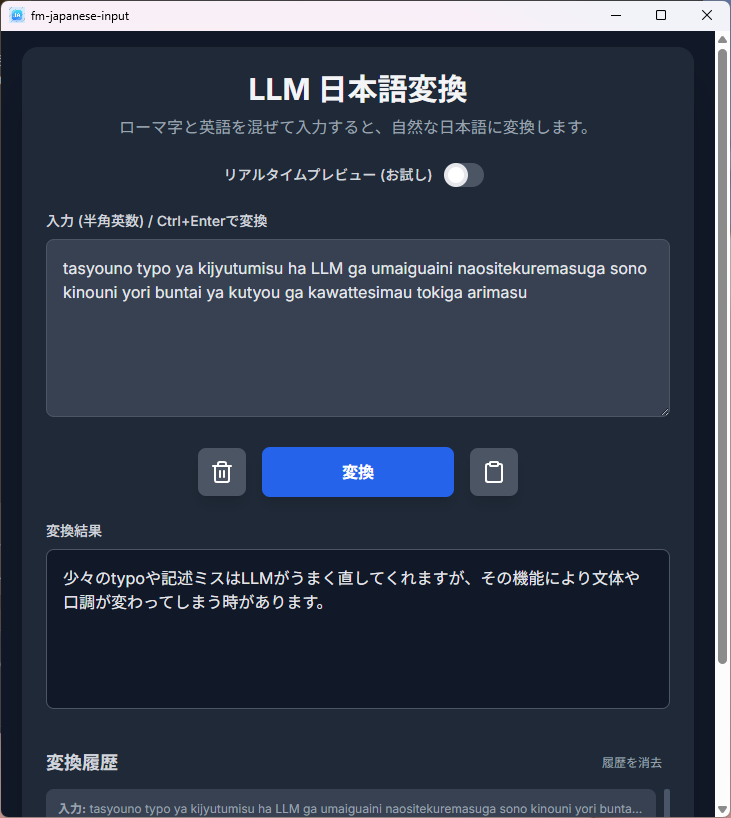

# fm-japanese-input

<p align="center">
  
</p>

LLM 日本語変換（ローマ字＋英語混在入力を自然な日本語へ変換するデスクトップアプリ）。

Google Gemini または OpenAI API 互換プロバイダ（OpenRouter / Ollama 等）を利用して変換を行います。Ollama 以外の外部 API を使用する場合は API キーを用意してください。

## 概要
- 半角英数（ローマ字）と英語が混ざったテキストを、文脈に沿って自然な日本語へ変換します。
- 英単語・英文はそのまま維持し、ローマ字部分のみを日本語（ひらがな・カタカナ・漢字）に変換します。
- 半角英数モードのまますべてを入力できるので、日本語と英単語の混在した文章を書くことが多いエンジニアにおすすめです。
- Neutralinojs を用いたクロスプラットフォームなデスクトップ UI。

## 利用方法まとめ
- github の Release から自分のマシン環境用のビルド済みバイナリ zip をダウンロード
- zip を解凍して任意のディレクトリに配置する
- ディレクトリの中、実行ファイルと同じ階層に`.env`ファイルを作成する
- `.env`ファイルの中にLLM APIのアクセスキーと利用するモデル名を記載する(詳細は以下に記載)
- 実行ファイルを起動(初回は不審なアプリとして警告が出るかもしれません)

## 主な機能
- 変換操作
  - 入力欄にテキストを入力し「変換」ボタン、または Ctrl+Enter で変換
- リアルタイムプレビュー（お試し）
  - トグルで ON/OFF
  - 入力の様子を 3 秒間隔で LLM に投げ、プレビュー結果を薄い文字色で表示（確定ではありません）
  - 多くの LLM リクエストを発生させることになりますので利用の際はお気を付けください
- コピー／リセット
  - 変換結果のコピー、入力のリセットボタンを用意
- 変換履歴
  - 直近最大 10 件を localStorage に保存
  - リストから選ぶと、入力欄と出力へ復元
  - 「履歴を消去」ボタンで全削除
- .env ファイルによる環境設定で使用するモデルを指定可能
  - OpenAI API 互換（OpenRouter / Ollama 等）のプロバイダ利用で色々なモデルが利用できます
  - 開発時の想定は gemini-2.5-flash で、これが一番良い変換をしてくれています

## 必要要件（概要）
- いずれかの LLM プロバイダ設定を `.env` に記述
  - OpenAI API 互換（OpenRouter / Ollama 等）
    - LLM_BASE_URL（例: https://openrouter.ai/api または http://localhost:11434）
    - LLM_MODEL（例: openai/gpt-4o-mini, llama3.1 など）
    - LLM_API_KEY（任意: OpenRouter 等で必要。Ollama は通常不要）
  - もしくは Google Gemini
    - GEMINI_API_KEY
    - 任意で LLM_MODEL（Gemini モデル名の上書き）
- 上記設定は環境変数への設定でも動作します
  - 環境変数で GEMINI_API_KEY が設定されていたらそれだけで動作する

## 設定と優先順位（OpenAI 互換 / Gemini）
このアプリは起動時に以下の順で環境変数や .env を解決し、動作モードを決定します。

1) OpenAI API 互換モード（優先）
- 条件: LLM_BASE_URL と LLM_MODEL が設定されている
- LLM_API_KEY は任意（OpenRouter などでは必要、Ollama では不要）
- エンドポイント: `${LLM_BASE_URL}/v1/chat/completions`
- リクエスト: messages 形式（system + user）、temperature=0.2、非ストリーミング
- 認証: LLM_API_KEY がある場合のみ Authorization: Bearer を付与

2) Gemini モード（フォールバック）
- 条件: OpenAI 互換モードでない かつ GEMINI_API_KEY が設定されている
- モデル名: LLM_MODEL があればそれを使用、なければデフォルト `gemini-2.5-flash`

3) 未設定
- いずれの条件も満たさない場合、UI 上で案内を表示し、変換操作は無効化されます。

解決順序（共通）
- OS 環境変数を優先し、無ければ .env（NL_PATH または NL_CWD 直下）を参照します。
- .env は KEY=VALUE 形式で、コメント行（#）や空行は無視されます。

`.env` 例（OpenRouter）:
```
LLM_BASE_URL=https://openrouter.ai/api
LLM_MODEL=openai/gpt-4o-mini
LLM_API_KEY=sk-or-v1_xxx
```

`.env` 例（Ollama）:
```
LLM_BASE_URL=http://localhost:11434
LLM_MODEL=llama3.1
# LLM_API_KEY は不要
```

`.env` 例（Gemini）:
```
GEMINI_API_KEY=your_gemini_key
# 任意で Gemini のモデル名を上書き
LLM_MODEL=gemini-1.5-flash
```

## 使い方（UI の流れ）
- 入力欄にローマ字混じりのテキストを入力
- Ctrl+Enter もしくは「変換」ボタンで変換を実行
- 結果は「変換結果」エリアに表示（コピー可能）
- プレビューを有効にすると、入力中も 3 秒間隔で下書き結果が表示されます（薄い文字色＝プレビュー）
- 履歴エリアから過去の入力/出力を復元可能。不要なら「履歴を消去」


## 既知の制約・注意
- API キー未設定時は変換できません。`.env` または環境変数の設定を確認してください。
- プレビューは入力ごとにリクエストが発生するため、レート制限に注意してください（必要に応じてトグルで OFF）。
- 変換ルール上、英語はそのまま維持されます。
- 少々のtypoや記述ミスはLLMがうまく直してくれますが、その機能により文体や口調が変わってしまう時があります。
- Mac版の動作は未確認です(作者が現在所有していないため)

## 開発者向け情報

### 開発環境のセットアップ
1. Node.js をインストールします（[公式サイト](https://nodejs.org/)からダウンロード）。
2. Neutralinojs CLI をグローバルにインストールします：
   ```bash
   npm install -g @neutralinojs/neu
   ```
3. リポジトリをクローンします：
   ```bash
   git clone https://github.com/rerofumi/fm-japanese-input.git
   cd fm-japanese-input
   ```
4. Neutralinojs の各種ファイルを更新します
   ```bash
   neu update
   ```
5. 開発用の `.env` ファイルをプロジェクトルートに作成し、必要なAPIキーを設定します（例: `GEMINI_API_KEY=your_key`）。

### アプリの実行
開発サーバーを起動するには、以下のコマンドを実行します：
```bash
neu run
```
これにより、アプリが開発モードで起動し、コードの変更を即座に反映できます。

### ビルド方法
リリース用のバイナリをビルドするには、以下のコマンドを使用します：
```bash
neu build --release
```
ビルドされたファイルは `bin/` ディレクトリに出力されます。

### プロジェクト構造
- `www/`：フロントエンドのHTML、JavaScript、CSSファイルが含まれます。
- `bin/`：各プラットフォーム向けの実行可能ファイルが含まれます。
- `neutralino.config.json`：Neutralinojsの設定ファイルです。

### 貢献方法
1. 変更を加えたいブランチを作成します。
2. 変更をコミットし、プルリクエストを作成します。
3. メンテナーがレビューを行い、マージします。

## ライセンス
- 本プロジェクトは MIT License です。詳細はリポジトリ同梱の `LICENSE` を参照してください。

## 作者

- **rerofumi**
    - [GitHub](https://github.com/rerofumi)
    - rero2@yuumu.org

## Changelog
- v0.1.0
  - first release
